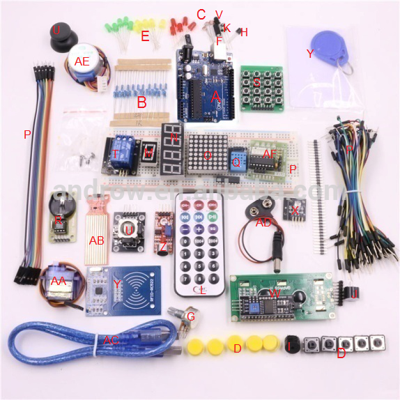

# Arduino Kit Sold by the Faculty of Engineering at Western University

This Git repository provides a listing of the parts included in the kit which is use for several Electrical & Computer Engineering Department.
Below is a list of the courses that some variant of this kit is used with for either structured lab exercises or design project deliverables.

 - MSE2202 A/B : Mechatronics lab course (*fill in proper course title*)
 - ECE2240 A/B : ECE lab course (*fill in proper course title*)
 - ES1050      : Engineering Practice and Principles

## Kit Contents

|Quantity |	Description	| Image Label |	Reference |	Datasheet |
|:-------:|-------------|:-----------:| --------- | --------- |
| 1	| Arduino Uno Rev3 | A	| www.arduino.cc |	  |
| 8	| 220 Ohm resistors | B |   |   |	 	 
| 5	| 1 KOhm resistors	| B	| 	|   |
| 5	| 10 KOhm resistors	| B	| 	|   |
| 3 | Photoresistors	| C	| Adafruit link |	| 
| 4	| Momentary Pushbuttons (yellow cap) |	D |	Descriptive Example |   |	 
| 5	| yellow LED |	E |    |    |	 	 
| 5	| red LED	| E	 |   |   | 	 
| 5	| blue LED	| E  |   |   |	 	 
| 1	| RGB tricolor LED |not shown |	Descriptive Example |   |	 
| 2	| SW-520D Tilt Sensors (roll-ball)	| F	| SW-520D Example |   | 	 
| 1	| 10 KOhm potentiometer	| G |   |   |	 	 
| 1	| LM35 Temperature sensor |	H |   |	 LM35 datasheet |
| 1	| 8-bit Serial-In / Parallel-out shift register | not shown | Descriptive Example |	74HC595D datasheet |
| 1	| Passive Buzzer (piezo buzzer)	| I	 |   |   | 	 
| 1	| Active Buzzer (tone generator) |	J	| Descriptive Example |   |	 
| 1 |	IR receiver (phototransistor) |	K |   |   |	 	 
| 1	| IR remote control keypad	| L	|    |    | 	 
| 1	| 8-segment single-digit LED display | M |   |   | 	 
| 1	| 8-segment four-digit LED display	| N	|   |   | 	 
| 1	| 8x8  dot-matrix LED display | O |   |   |	 	 
| 1, 40	| MB-102 Breadboard,  jumper wires	| P |   |   |	 	 
| 1	| DHT11 Humidity Sensor	| Q	|    |    | 	 
| 1	| RTC (Real-Time Clock) module	| R	|    |    | 	 
| 1	| 4x4 mini-pushbutton matrix | S |    |    |	 	 
| 1	| 5V Relay module | T |    |    |	 	 
| 1	| Joystick module | U |    |    |	 	 
| 1	| Flame sensor	| V	|    |   | 	 
| 1	| LCD 1602 Screen with I2C serial interface	| W |    |    |	 	 
| 1	| RGB module | X |    |    |	 	 
| 1	| RFID-RC522 module, S50 blank IC card, S50 disc |	Y	|   |   | 	 
| 1	| microphone sound sensor module | Z |   |   | 
| 1 | SG90 Servo Motor	| AA | Descriptive Example | Servo library |
| 1	| Water level sensor | AB |   |   |	 	 
| 1	| USB cable	| AC |   |   |	 	 
| 1	| 9V battery connector	| AD |   |   |	 	 
| 1	| 5V unipolar stepper motor (28byj-48) | AE | Descriptive Example |   | 
| 1	| Uln2003 Stepper motor driver board | AF | Example, Stepper library | Datasheet |

## Code Samples

This section provides code samples demostrating the operation of each component interfaced to the  **Arduino Uno R3** board included in the kit.

**Note 1 :** some minor changes relate to pin assignment may be required if you are using a different board

**Note 2 :** make sure that if another board is used, then it is selected in the Arduino IDE so that your source code compiles against the appropriate memory map.

### Part A : 

### Part B :

### Part C :

### Part D :

### Part E :

### Part F :

### Part G :

### Part H :

### Part I :

### Part J :

### Part K :

### Part L :

### Part M :

### Part N :

### Part O :

### Part P :

### Part Q :

### Part R :

### Part S :

### Part T :

### Part U :

### Part V :

### Part W :

### Part X :

### Part Y :

### Part Z :

### Part AA :

### Part AB :

### Part AC :

### Part AD :

### Part AE :

### Part AF :

