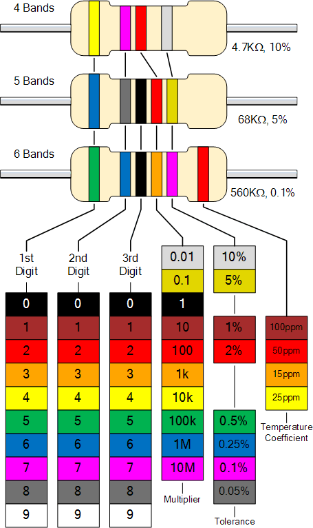

# Arduino Kit Sold by the Faculty of Engineering at Western University

This Git repository provides a listing of the parts included in the kit which is use for several Electrical & Computer Engineering Department.
Below is a list of the courses that some variant of this kit is used with for either structured lab exercises or design project deliverables.

 - MSE2202 A/B : Mechatronics lab course (*fill in proper course title*)
 - ECE2240 A/B : ECE lab course (*fill in proper course title*)
 - ES1050      : Engineering Practice and Principles

## Kit Contents

|Quantity |	Description	| Image Label |	Reference |	Datasheet |
|:-------:|-------------|:-----------:| --------- | --------- |
| 1	| Arduino Uno Rev3 | A	| www.arduino.cc |	  |
| 8	| 220 Ohm resistors | B |   |   |	 	 
| 5	| 1 KOhm resistors	| B	| 	|   |
| 5	| 10 KOhm resistors	| B	| 	|   |
| 3 | Photocell	| C	| [Adafruit link](https://learn.adafruit.com/photocells/overview) |   | 
| 4	| Momentary Pushbuttons (yellow cap) |	D |	Descriptive Example |   |	 
| 5	| yellow LED |	E |    |    |	 	 
| 5	| red LED	| E	 |   |   | 	 
| 5	| blue LED	| E  |   |   |	 	 
| 1	| RGB tricolor LED |not shown |	Descriptive Example |   |	 
| 2	| SW-520D Tilt Sensors (roll-ball)	| F	| SW-520D Example |   | 	 
| 1	| 10 KOhm potentiometer	| G |   |   |	 	 
| 1	| LM35 Temperature sensor |	H |   |	 LM35 datasheet |
| 1	| 8-bit Serial-In / Parallel-out shift register | not shown | Descriptive Example |	74HC595D datasheet |
| 1	| Passive Buzzer (piezo buzzer)	| I	 |   |   | 	 
| 1	| Active Buzzer (tone generator) |	J	| Descriptive Example |   |	 
| 1 |	IR receiver (phototransistor) |	K |   |   |	 	 
| 1	| IR remote control keypad	| L	|    |    | 	 
| 1	| 8-segment single-digit LED display | M |   |   | 	 
| 1	| 8-segment four-digit LED display	| N	|   |   | 	 
| 1	| 8x8  dot-matrix LED display | O |   |   |	 	 
| 1, 40	| MB-102 Breadboard,  jumper wires	| P |   |   |	 	 
| 1	| DHT11 Humidity Sensor	| Q	|    |    | 	 
| 1	| RTC (Real-Time Clock) module	| R	|    |    | 	 
| 1	| 4x4 mini-pushbutton matrix | S |    |    |	 	 
| 1	| 5V Relay module | T |    |    |	 	 
| 1	| Joystick module | U |    |    |	 	 
| 1	| Flame sensor	| V	|    |   | 	 
| 1	| LCD 1602 Screen with I2C serial interface	| W |    |    |	 	 
| 1	| RGB module | X |    |    |	 	 
| 1	| RFID-RC522 module, S50 blank IC card, S50 disc |	Y	|   |   | 	 
| 1	| microphone sound sensor module | Z |   |   | 
| 1 | SG90 Servo Motor	| AA | Descriptive Example | Servo library |
| 1	| Water level sensor | AB |   |   |	 	 
| 1	| USB cable	| AC |   |   |	 	 
| 1	| 9V battery connector	| AD |   |   |	 	 
| 1	| 5V unipolar stepper motor (28byj-48) | AE | Descriptive Example |   | 
| 1	| Uln2003 Stepper motor driver board | AF | Example, Stepper library | Datasheet |

## Part Description and Code Samples

This section provides a description of each part in the kit and where appropriate some code samples demostrating the operation of each component interfaced to the  **Arduino Uno R3** board.  Some additional links may be provided to point you to further reading that will helpful for those that are new to creating embedded applications.

**Note 1 :** some minor changes relate to pin assignment may be required if you are using a different board

**Note 2 :** if you choose to use a different arduino board, then ensure it is selected in the Arduino IDE so that your source code compiles against the appropriate memory map.

### Part A : *Uno Revision 3 board*

The Uno R3 is the most commonly used board in the Arduino platform family.  If you are new to using Arduino based microcontrollers then it is worthwhile to familiarize yourself with its layout.  In particular, note the number and type of I/O pins that are available for your use.

<https://store.arduino.cc/usa/arduino-uno-rev3>

Be sure to look through **TECH SPECS** and **DOCUMENTATION** tabs on that page.

### Part B : *Set of pin-through-hole resistors*

The small set of resistors included are typical values that are commonly used with other parts in this kit.  It is likely that you will need to acquire additional resistors of other values depending on the external circuits you choose to build.  Below is a handy resistor colour code chart that will help you determine the resistance value.  Typically you will encounter 4-band resistors.

### Part C : *Photocell (or photoresistor)*

The photocell is a light-controlled variable resistor will change with exposure to light.  The units included have the following typical resistance values
- reasonably bright room (100 Lux) : 5 Kohm
- darkness : 1 Mohm

[Adafruit link](https://learn.adafruit.com/photocells/overview) provided in the table above and here gives a nicely detailed explanation of photocells.

It is a good idea to measure the ohmic value of the cell under the specific operating point (lighting conditions) for your application with a multimeter before you get started.

### Part D :

### Part E :

### Part F :

### Part G :

### Part H :

### Part I :

### Part J :

### Part K :

### Part L :

### Part M :

### Part N :

### Part O :

### Part P :

### Part Q :

### Part R :

### Part S :

### Part T :

### Part U :

### Part V :

### Part W :

### Part X :

### Part Y :

### Part Z :

### Part AA :

### Part AB :

### Part AC :

### Part AD :

### Part AE :

### Part AF :

